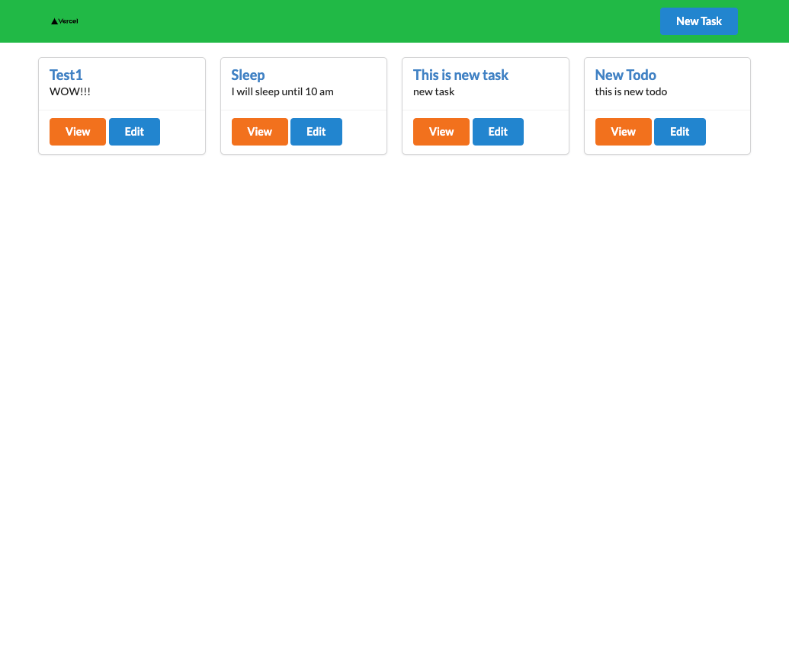

This is my first Next.js Fullstack Todo App.
The project is from Youtube video (https://www.youtube.com/watch?v=SiUM8vYeuu0)

This is not my own project. So, I decided to not deploy demosite.

## Project purpose

I finished next.js tutorials for beginners (Youtube: Codevolution Next.js series: https://www.youtube.com/watch?v=9P8mASSREYM&list=PLC3y8-rFHvwgC9mj0qv972IO5DmD-H0ZH). 

And I wanted to try create something. (But I didn't have a confidence for creating fullstack application).
So, I tried to challenge this project.

Now, I have a little bit confidence and I am going to create todo app by my own.

## Features

- CRUD API 
- next.js fullstack

### Env Variables (.env.local)

"MONGO_USERNAME": "your mongodb usename here",  
"MONGO_PASSWORD": "your mongodb password here",  
"MONGO_DATABASE": "your mongo db database name here"

Thank you for reading.
And, happy coding!!
